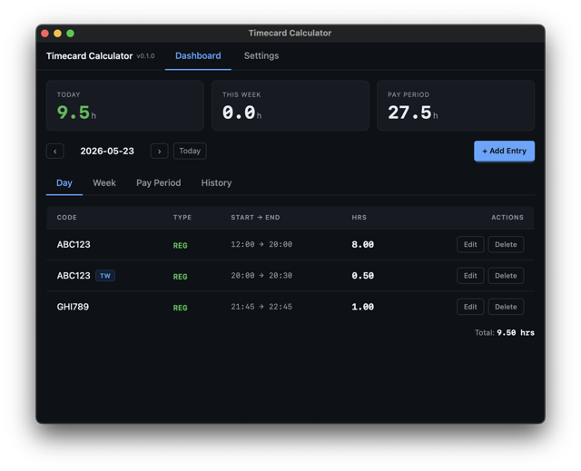
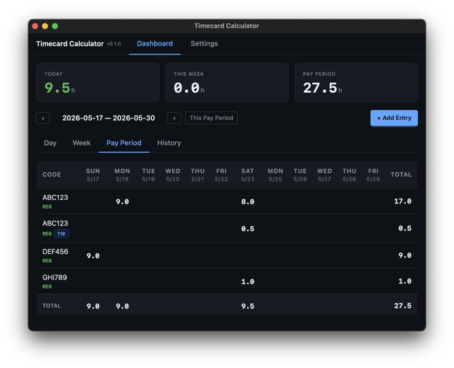
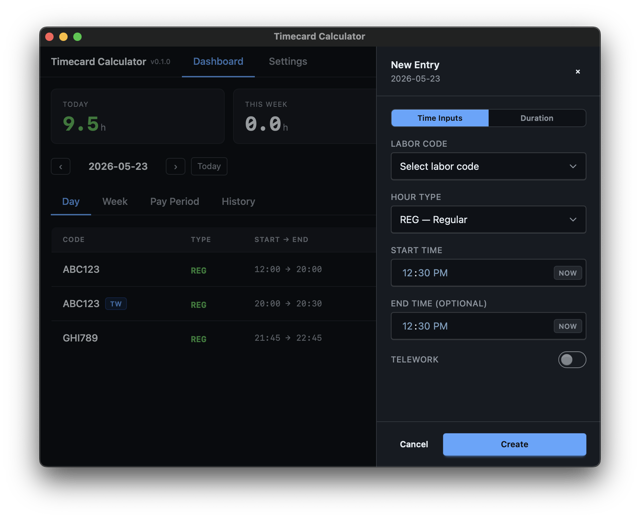
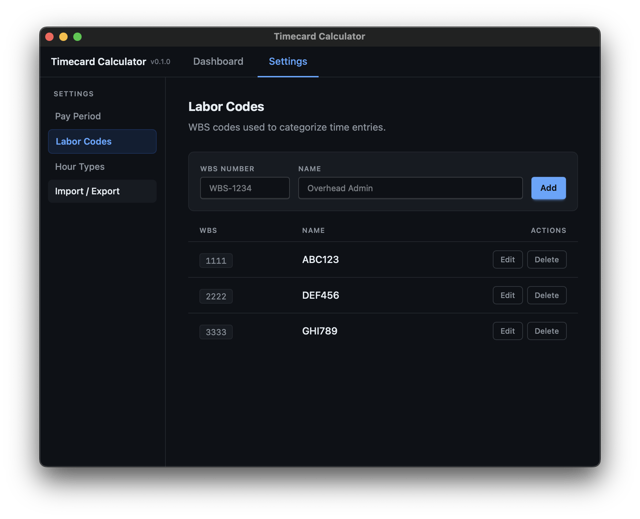
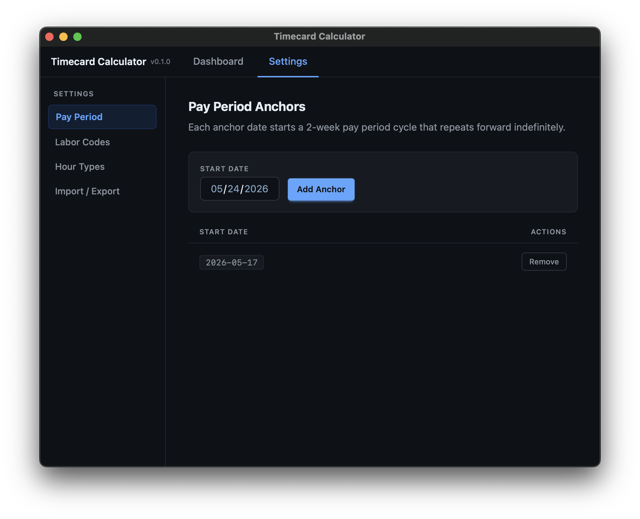

# Timecard Calculator

A desktop app for logging work hours against labor codes and hour types. Stores everything locally in SQLite — no account, no sync, no server.

Built with Rust and [Dioxus](https://dioxuslabs.com/).

---

## What it does

You log time entries with a start time, end time, labor code (WBS number), and hour type (REG, OVT, etc.). The app aggregates those entries into day, week, and pay period summaries displayed as pivot tables.

Hours are rounded to the nearest 15-minute interval. Overlapping entries are flagged in red.

## Features

**Logging entries**
- Start/end time picker, or enter decimal hours directly
- "Start Now" and "End Now" buttons that snap to the nearest 15 minutes
- Telework toggle per entry
- In-progress entries (no end time) show as incomplete in summaries

**Views**
- **Day** — all entries for a date, running total
- **Week** — pivot table of hours by labor code and day
- **Pay Period** — same pivot across a multi-week pay period
- Stat cards showing today's hours, week total, and pay period total with color-coded status

**Settings**
- Define labor codes (WBS number + name)
- Define hour types (code + name + optional badge style)
- Set pay period anchor dates
- Import/export entries and lookup data as JSON

**What it doesn't do**
- No cloud sync or multi-device support
- No time tracking from a running timer (you enter start/end manually, or use the "Now" buttons)
- The History tab is a placeholder — not implemented yet
- Pay period view requires configuring at least one anchor date first

## Screenshots

### Day View



### Pay Period View



### New Entry



### Settings: Labor Codes



### Settings: Pay Period Anchors



## Building

Requires Rust and the [Dioxus CLI](https://dioxuslabs.com/learn/0.7/getting_started/):

```sh
cargo install dioxus-cli
```

Run with hot reload:

```sh
dx serve
```

The database is created automatically at `{platform data dir}/timecard-calc/timecard.db` on first launch.

## Development

```sh
just lint          # cargo clippy
just test          # cargo test
just sqlx-prepare  # regenerate sqlx query cache after schema changes
```

After modifying any `sqlx::query!` calls, run `just sqlx-prepare` before building — the project compiles in offline mode and the cache must be current.

## Tech stack

- **Rust** — app logic and data layer
- **Dioxus 0.7** — UI framework (desktop target)
- **SQLite via sqlx** — local persistence
- **Tailwind CSS + DaisyUI** — styling

## License

Apache 2.0
